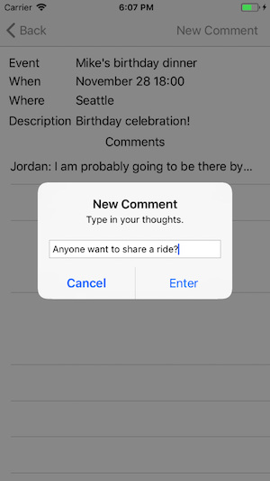

# Introduction

This is a starter application for using the sample app in the AWS AppSync console when building your GraphQL API. The sample app creates a GraphQL schema and provisions Amazon DynamoDB resources, then connects them appropriately with Resolvers. The application demonstrates GraphQL Mutations, Queries and Subscriptions using AWS AppSync. You can use this for learning purposes or adapt either the application or the GraphQL Schema to meet your needs.



## Features

- GraphQL Mutations
  - Create new events
  - Create comments on existing events
  - Delete an event (swipe left on event)

- GraphQL Queries
  - Get all events (w/ pagination support)
  - Get an event by Id

- GraphQL Subscriptions
  - Real time updates for comments on an event

- Authorization
  - The app uses API Key as the authorization mechanism

## Requirements

* Xcode 9 or later
* iOS 9 or later
* CocoaPods

## AWS Setup

1. Navigate to the AWS AppSync console using the URL: http://console.aws.amazon.com/appsync/home

2. Click on `Create API` and select the `Event App` under the `sample project` in the bottom pane, and select `Start`. Enter a API name of your choice. Click `Create`.

## iOS Setup

Clone this repository:

```
git clone https://github.com/aws-samples/aws-mobile-appsync-events-starter-ios.git
```

Wait until the progress bar at the top has completed deploying your resources. Then from the integration page of your GraphQL API (you can click the name you entered in the left hand navigation). 

On this same page, select `iOS` at the bottom to download your `awsconfiguration.json` configuration file by clicking the **Download Config** button. Replace the `awsconfiguration.json` file in the root of your app with the file you just downloaded.

To setup the dependencies in the app, navigate to the project you just cloned from a terminal and run: 

```
pod install
``` 

Now open `EventsApp.xcworkspace`, then build and run the app.

## Application Walkthrough

### EventsAPI.swift

- The EventsAPI.swift file contains code generated through `aws-appsync-codegen` based on the GraphQL schema. It requires you to define a .graphql file and the schema.json for your API. For this example, they are in events.graphql and schema-events.json. If you update your schema in the future, you should use the [AWS Amplify CLI](https://aws-amplify.github.io/) codegen feature to automatically download and update your queries, mutations, subscriptions and the schema. For a tutorial of this, [click here](https://github.com/aws-amplify/amplify-cli/blob/master/native_guide.md).

### EventListViewController (Query)

- The `EventListViewController` file lists all the events accessible to the user. It returns data from the offline cache first if available and later fetches it from remote to update the local cache.

### EventDetailsViewController (Mutation, Query, Subscription)

- The `EventDetailsViewController` file lists information about an event and allows new comments to be added. It also subscribes to live updates for new comments which are made on that post.

### AddEventViewController (Mutation)

- The `AddEventViewController` creates a new event using the details entered on screen. 

## Getting Help

We use [AppSync iOS SDK GitHub issues](https://github.com/awslabs/aws-mobile-appsync-sdk-ios/issues) for tracking questions, bugs, and feature requests.
