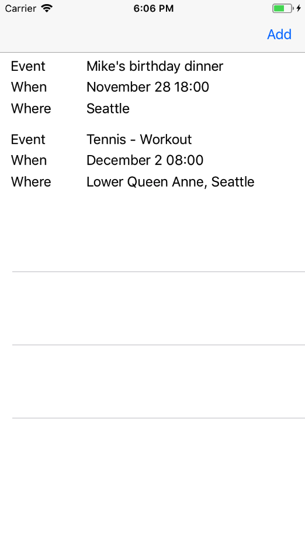
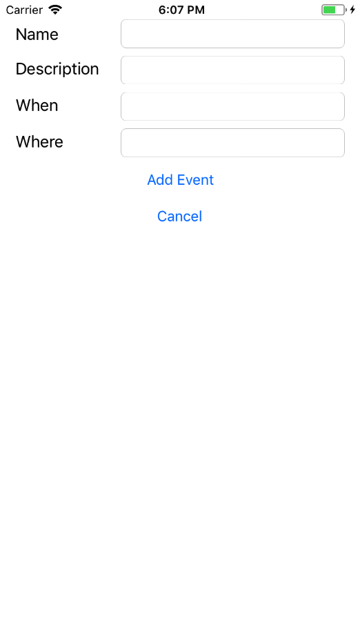

# Introduction

This is a Starter application for using the Sample app in the AWS AppSync console when building your GraphQL API. The Sample app creates a GraphQL schema and provisions Amazon DynamoDB resources, then connects them appropriately with Resolvers. The application demonstrates GraphQL Mutations, Queries and Subscriptions using AWS AppSync. You can use this for learning purposes or adapt either the application or the GraphQL Schema to meet your needs.

## Features

- Mutation
  - Create new events
  - Create comments on existing events

- Queries
  - Get all events (w/ pagination support)
  - Get an event by Id

- Subscription
  - Real time updates for comments on an event

- Authorization
  - The app uses API Key as the authoriation mechanism

## AWS Setup

1. Please visit AWS AppSync console using the URL: http://console.aws.amazon.com/appsync/home

2. Click on `Create API` and select the `Sample Schema` option and give it an API name of your choice. Click `Create`.

3. Next, use the git clone command specified on the console to clone the sample app.

4. In the sample app which you just downloaded, copy the `API URL` and `API Key` and paste it in the `Constants.swift` file.

5. To setup the dependencies in the app, you can run `pod install` from the root directory of the app, and then open `EventsApp.xcworkspace` file.

## Application Walkthrough

### EventsAPI.swift

- The EventsAPI.swift file contains code generated through `aws-apollo-codegen` based on the schema. It requires you to define a .graphql file and the schema.json for your API. For this example they are in events.graphql and schema-events.json.
- To add new mutations, queries or subscriptions into your app, you could extend the events.graphql file to add additional operations.
- Then run `aws-appsync-codegen generate events.graphql --schema schema-events.json --output EventsAPI.swift` to generate the updated `EventssAPI.swift` file with additional operations.

### EventListViewController (Query)

- The `EventListViewController` file lists all the events accessible to the user. It returns data from the offline cache first if avialble and later fetches it from remote to update the local cache.

### EventDetailsViewController (Mutation, Query, Subscription)

- The `EventDetailsViewController` file list information about an event and allows new comments to be added. It also subscribes to live updates for new comments which are made on that post.

### AddEventViewController (Mutation)

- The `AddEventViewController` creates a new event using the details entered on screen. 

